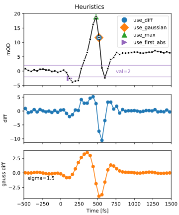

Dispersion correction
=====================
It is common to use chirped probe pulses in visible fs-pump-probe
spectroscopy. This results in a wavelength depended time-zero, since the
different probe wavelength arrive at different times at the sample. The chirp
is generally well modeled by a low-order polynomial. Therefore to work with
dispersion affected spectra, it is necessary to know to dispersion curve.restr

There are various ways to measure the dispersion directly.
Alternatively, one can estimate the dispersion directly form the data. The
estimate can used to correct the spectrum directly, or if the dispersion is
explictly part of the fitted model, used as the starting guess.

Estimating the dispersion
-------------------------
*skultrafast* can estimate the dispersion by first using a heuristic which
estimates the time-zero for each wavelengths. The resulting curve is then
fitted with a polynomial using a robust fitting method. The robust method is
necessary since the heuristics are error-prone.

*skultrafast* comes with four different heuristics:

1.  `zero_finding.use_diff`, returns the index where the largest signal change is located.
2.  `zero_finding.use_max`, returns the index with the largest positive signal. This
    useful when the solvent contribution is strong.
3.  `zero_finding.use_gaussian`, returns the index where the convolution with the first
    derivative of an gaussian is the largest. This works like a averaged
    version of `use_diff`.
4.  `zero_finding.use_first_abs`, returns the earliest index where the absolute of the signal is
    above a given threshold. The methods works best when the threshold is
    small, therefore indicating the first signal contributions above the noise
    floor. This captures the dispersion curve quite well, minus a slight
    offset, since it captures the beginning of the pump-probe interaction.

Additionally, user-given heuristics are supported.

The heuristic function are located in the :py:mod:`zero_finding` module. Working
directly with the functions should not be necessary, when using the 
:py:obj:`~dataset.DataSet`
class.

In the second step, the resulting :math:`t_0(\omega)` data is approximated
with a polynomial of low degree, using a robust fitting method form
statsmodels. The polynomial is fitted in the wavenumber-space, since the 
dispersion is propotional to the frequency. 

Using the estimate
------------------

